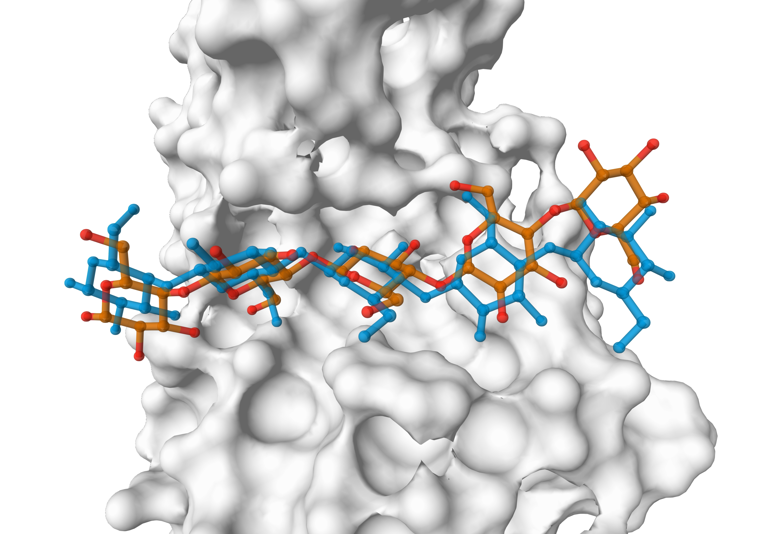

# Protein-glycan docking with HADDOCK3

This repository contains all data and analysis necessary to reproduce the results reported in [this paper](https://www.biorxiv.org/content/10.1101/2024.07.31.605986v1).

The repository contains the following directories

- **analysis**, with all the analysis scripts to generate the figures present in the paper

- **data**, with all the data generated in this study
  - **df_ss_all_data.tsv**: for each pdb and each docking scenario, it is reported whether there is (1) or there is not (0) at least one high, medium, acceptable, or near-acceptable model among the top 1, 5, 10, 50, 100 and 200 models. This is calculated after [rigidbody](https://www.bonvinlab.org/haddock3/modules/sampling/haddock.modules.sampling.rigidbody.html) sampling (2_caprieval) and on the rigidbody clustered models (5_caprieval) for bound docking. For unbound docking, this is calculated after rigidbody sampling (02_caprieval), on the rigidbody clustered models (06_caprieval), after [flexref](https://www.bonvinlab.org/haddock3/modules/refinement/haddock.modules.refinement.flexref.html) (08_caprieval), and on the flexref clustered models (11_caprieval).
  - **df_clt_all_data.tsv**: for each pdb and each docking scenario, it is reported whether there is (1) or there is not (0) at least one high, medium, acceptable, or near-acceptable model among the best 4 scoring models contained in the top 1, 2, 3, 4, 5, 10, 20, 30, 40 and 50 clusters. This is calculated on the rigidbody clustered models (5_caprieval) for bound docking. For unbound docking, this is calculated on the rigidbody clustered models (06_caprieval) and on the flexref clustered models (11_caprieval).
 
  
- **pdb_files**. This directory contains subdirectories for each PDB (relative to the protein-glycan complex). In each `pdb_files/PDB/` subdirectory the following files are available:
  - **154L_r_b.pdb**: protein bound structure
  - **154L_l_b.pdb**: glycan bound structure
  - **154L_r_u.pdb**: protein unbound structure
  - **154L_l_u.pdb**: glycan unbound structure
  - **154L_l_ensemble.pdb**: glycan ensemble, obtained with [mdref](https://www.bonvinlab.org/haddock3/modules/refinement/haddock.modules.refinement.mdref.html)
  - **154L_analysis.pdb**: reference structure
  - **154L_ti-aa.tbl**: AIRs file, ti-aa restraints (true interface on both protein and glycan)
  - **154L_tip-ap.tbl**: AIRs file, tip-ap restraints (true-interface-protein, glycan fully passive)

- **cfg_files**. It contains subdirectories for each PDB (relative to the protein-glycan complex). In each `cfg_files/PDB/` subdirectory the following files are available:
  - **bound_default_ti-aa.toml**: bound docking, default haddock scoring function, ti-aa AIRs
  - **bound_vdw_ti-aa.toml**: bound docking, vdW haddock scoring function, ti-aa AIRs
  - **bound_vdw_tip-ap.toml**: bound docking, vdW haddock scoring function, tip-ap AIRs
  - **unbound_vdw_tip-ap_clust.toml**: unbound docking, vdW haddock scoring function, tip-ap AIRs
  - **unbound_ens_vdw_tip-ap_clust.toml**: ensemble docking, vdW haddock scoring function, tip-ap AIRs
  - **mdref-glycans-sf400x16.toml**: sampling of glycan conformations using mdref
